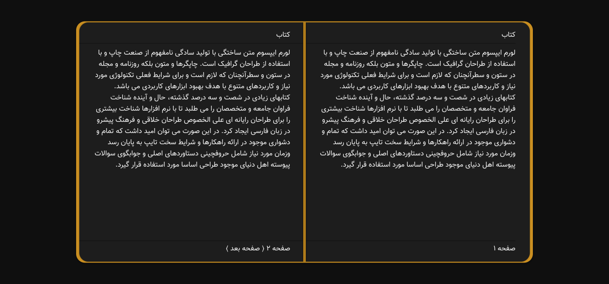
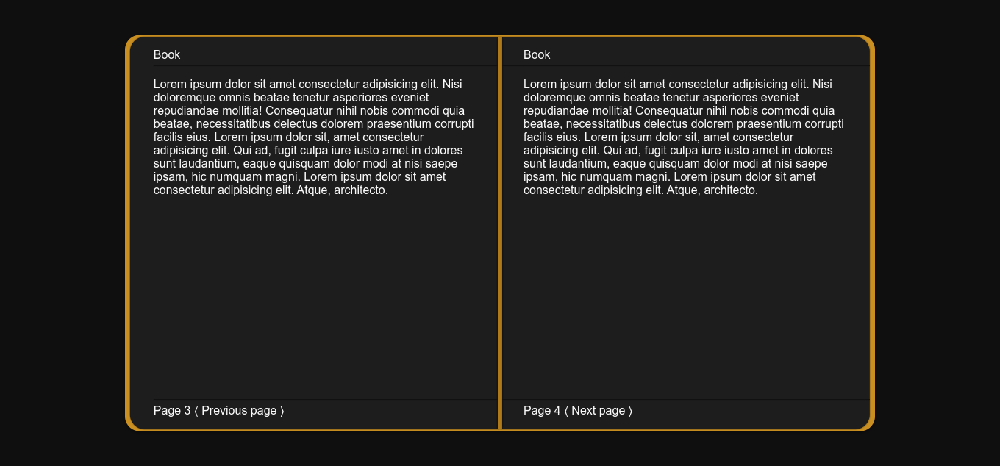
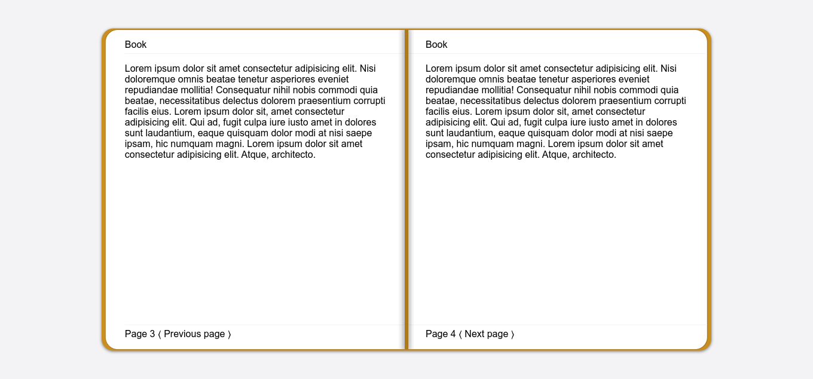
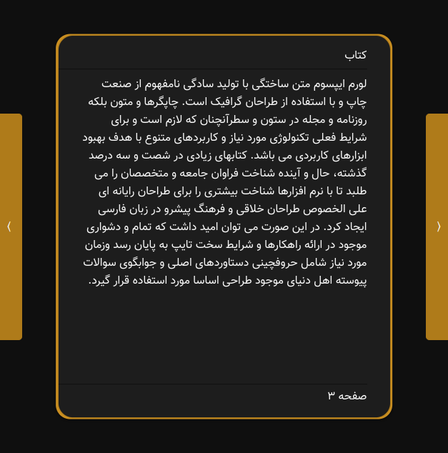
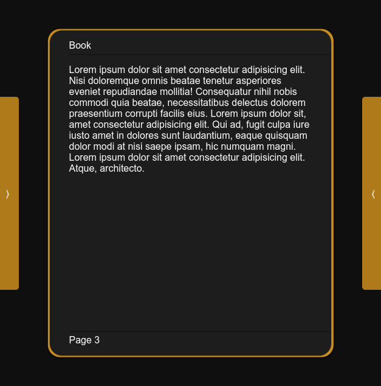
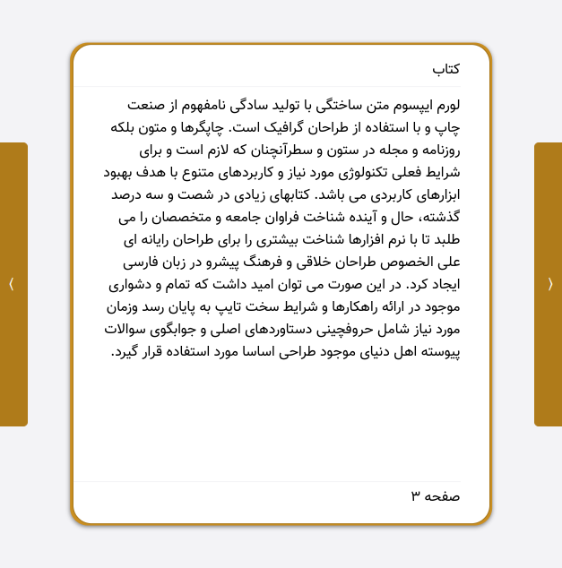
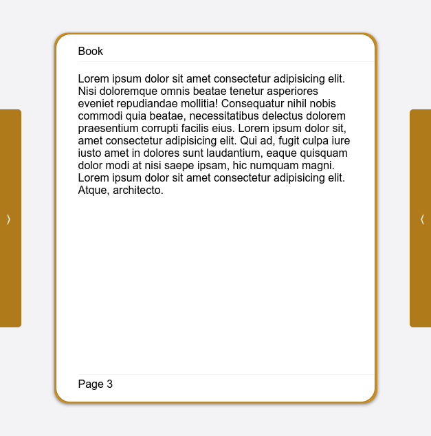

a Simple and Esey Web Ui Template, Create with [GodUi](https://github.com/GodratmandProject/GodUi)

### Screenshot 🖼

|||
|---|---|
|||

#### Mobile 📱

|||
|---|---|
|||

### Use Tamplate ⚒

1. import GodUi in your Page
    ```html
    <link rel="stylesheet" href="https://unpkg.com/godratmand-ui@1.3.1/build/GodUi.min.css">
    <!-- RTL  -->
    <link rel="stylesheet" href="https://unpkg.com/godratmand-ui@1.3.1/build/GodUi.rtl.min.css">
    ```
2. import Book style
    ```html
    <link rel="stylesheet" href="https://book-template.pages.dev/src/Book.css">
    ```
3. import Book.js script
    ```html
    <script src="https://book-template.pages.dev/src/Book.js"></script>
    ```
4. Config script
    ```html
    <script>
    var bookName = "Book";
    var Lang = "fa" or "en";
    </script>
    ```
5. Use `Page` and `article` tag

**Tip**: You can also use the demo in this repository

### Contribute 🤝

This project is offered under the MIT license and you can make any changes, modifications, etc. in it freely.

---

<div align="center">

**Developed with ❤️ in 2022 by [Gnkalk](https://github.com/Gnkalk)**

</div>
